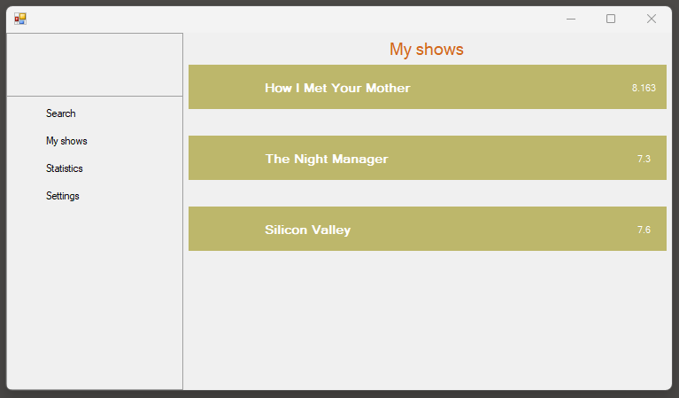
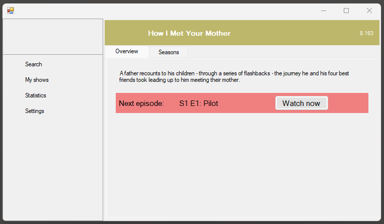
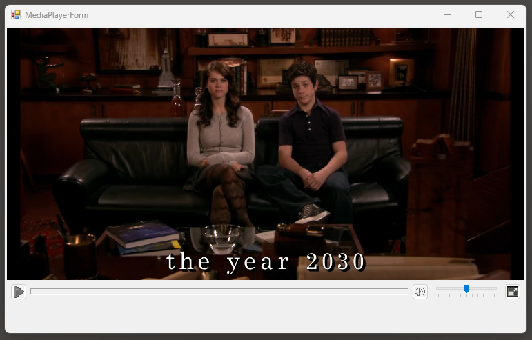

Episodeum is an all-in-one offline series manager application that lets you track and watch all your favourite series.

  
  

With the built-in media player functionality, you can conveniently watch the episodes in order, and have the ability to pause anytime and resume later.

Find out more about my projects at [soma.veszelovszki.hu](https://soma.veszelovszki.hu)